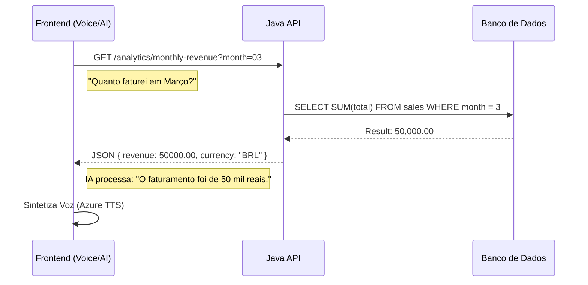

# 📊 Financial Analytics AI API

> 🤖 **Projeto Colaborativo** | **O meu papel:** Integração com Azure OpenAI, Engenharia de Prompt e Análise de Dados.

Esta API atua como o cérebro de um Dashboard Financeiro Inteligente. O objetivo não é apenas registrar transações, mas permitir que o usuário faça perguntas complexas (ex: *"Quanto a filial X faturou mês passado?"*) e receba respostas faladas precisas, baseadas em dados reais.

## 👨‍💻 Minha Contribuição Técnica

Neste projeto em grupo, atuei como **Engenheiro de Integração e Dados**, focado em conectar a Inteligência Artificial às regras de negócio do Back-End:

### 1. Azure OpenAI & Speech Services
Liderei a arquitetura da solução de IA:
* **Speech-to-Text:** Implementação do serviço da Azure para converter a voz do usuário em texto processável.
* **Text-to-Speech:** Conversão da resposta da IA em áudio natural para acessibilidade.
* **Integração OpenAI:** Configuração do modelo para interpretar intenções financeiras.

### 2. Engenharia de Prompt (AI-to-JSON)
Um dos maiores desafios foi garantir que o Back-End entendesse o que a IA queria dizer. Para isso, desenvolvi um **System Prompt** otimizado que força a OpenAI a retornar um JSON estruturado em vez de texto solto.

**Exemplo real do fluxo:**
1. **Usuário fala:** *"Qual foi o total de entradas da Filial 2 entre janeiro e março?"*
2. **IA Processa e Retorna (JSON Estrito):**
   ```json
   {
      "acao": "consultar_somatorio_transacao_por_filial_tipo_e_intervalo",
      "tipo": "entrada",
      "mesInicio": 1,
      "mesFim": 3,
      "filial": "Filial 2"
   }
---

## 🏗️ Fluxo da Inteligência (RAG Simplificado)

O back-end atua como o provedor de contexto factual para a IA generativa.



---

🛠️ Tecnologias Utilizadas
<div style="display: inline_block"> 
  
  
  
  </div>

Back-End: Java 17, Spring Boot, Spring Data JPA.

Cloud & AI: Azure Cognitive Services (Speech & OpenAI).

Dados: Consultas analíticas e agregações no MySQL.

🚀 Como executar a API

```
# Clone o repositório
$ git clone [https://github.com/igorhgds/back-end-financial-system-ai.git](https://github.com/igorhgds/back-end-financial-system-ai.git)

# Acesse a pasta
$ cd back-end-financial-system-ai

# Execute a aplicação com Maven
$ mvn spring-boot:run
```
